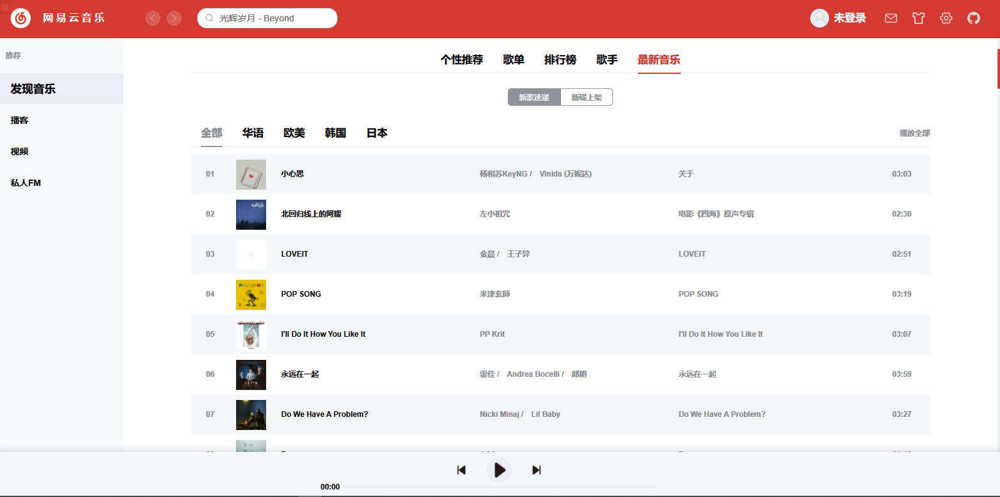

# Vue-NeteaseCloud-WebMusic

## 简介

基于 Vue2、Vue-CLI4，仿照 windows 网易云音乐的客户端 UI 界面进行开发设计，并作适当修改

## 技术栈

- 前端：***vue2 全家桶*** 通过 Vue-CLI4 初始化生成
- 后端：***[NeteaseCloudMusicApi](https://github.com/Binaryify/NeteaseCloudMusicApi)*** 提供所有后端数据

## 目录

```
·
|-- api  后台接口
|-- assets  静态资源
|-- base  基础 UI 组件
|-- components 页面模块组件
|-- config  业务配置
|-- layout  页面基础布局
|-- router  路由
|-- store  全局状态管理
|-- style  样式
|-- utils  工具方法
`-- views  具体页面
```

## 功能预览

+ 个性推荐
+ 歌单
+ 排行榜

+ 歌手
+ 最新音乐
+ 播放列表
+ 当前歌曲
+ 视频播放

## 使用方法

1. 运行后端仓库

   见 [NeteaseCloudMusicApi](https://github.com/Binaryify/NeteaseCloudMusicApi)

2. 运行本仓库

   ```bash
   npm install
   npm run serve
   ```

   

   
